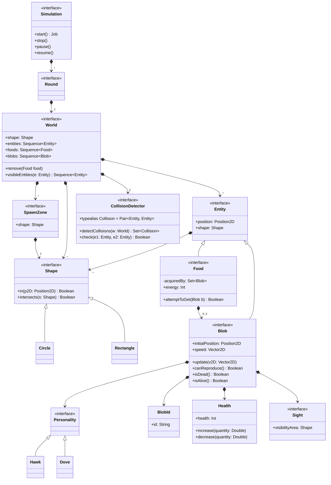

# Evolutionary Agent-based Aggression Simulation - EvASim

```mermaid
classDiagram
    direction TB

    class Simulation {
        <<interface>>
        +start() Job
        +stop()
        +pause()
        +resume()
    }

    class Round {
        <<interface>>
    }
    Simulation *--> "*" Round

    class SpawnZone {
        <<interface>>
        +shape: Shape
    }
    SpawnZone *--> "1" Shape

    class World {
        <<interface>>
        +shape: Shape
        +entities: Sequence~Entity~
        +foods: Sequence~Food~
        +blobs: Sequence~Blob~
        +remove(Food food)
        +visibleEntities(e: Entity) Sequence~Entity~
    }
    Round *--> "1" World
    World *--> "*" Entity
    World *--> "*" SpawnZone

    class Shape {
        <<interface>>
        +in(p2D: Position2D) Boolean
        +intersects(s: Shape) Boolean
    }
    class Circle
    Shape <|-- Circle
    class Rectangle
    Shape <|-- Rectangle
    World *--> "*" Shape

    class CollisionDetector {
        <<interface>>
        +typealias Collision = Pair~Entity, Entity~
        +detectCollisions(w: World) Set~Collision~
        +check(e1: Entity, e2: Entity) Boolean
    }
    World *--> "1" CollisionDetector
    
    class Entity {
        <<interface>>
        +position: Position2D
        +shape: Shape
    }
    Entity *--> "*" Shape

    class Food {
        <<interface>>
        -acquiredBy: Set~Blob~
        +energy: Int
        +attemptToGet(Blob b) Boolean
    }
    Entity <|-- Food
    Food *--> "0..2" Blob
    
%%    class Piece {
%%        <<interface>>
%%    }
%%    Food *--> "2" Piece
    
    class Blob {
        <<interface>>
        +initialPosition: Position2D
        +speed: Vector2D
        +update(v2D: Vector2D)
        +canReproduce() Boolean
        +isDead() Boolean
        +isAlive() Boolean
    }
    Entity <|-- Blob

    class Personality {
        <<interface>>
    }
    Blob *--> Personality
    class Hawk
    Personality <|-- Hawk
    class Dove 
    Personality <|-- Dove

    class BlobId {
        +id: String
    }
    Blob *--> BlobId
    
    class Health {
        +health: Int
        +increase(quantity: Double)
        +decrease(quantity: Double)
    }
    Blob *--> Health
    
    class Sight {
        <<interface>>
        +visibilityArea: Shape
    }
    Blob *--> Sight
    
%%    class Position2D {
%%        <<interface>>
%%        +x: Double
%%        +y: Double
%%    }
%%    Entity *--> Position2D
%%    
%%    class Vector2D {
%%        <<interface>>
%%    }
%%    Blob *--> Vector2D
```
