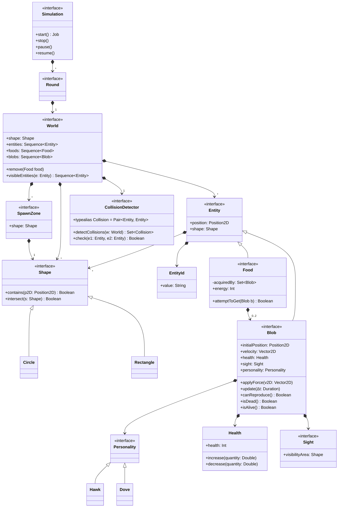

# Evolutionary Agent-based Aggression Simulation - EvASim

## Goals of the project

## Requirements Analysis

## Design



### Agents

<!--

#### Goals

- `+!find_food`: reazione dell'agente: in futuro può essere programmato un comportamento più intelligente
del semplice continuare a muoversi verso la direzione prestabilita iniziale per cercare di "spottare" il cibo

#### Belief

+ `food` => viene aggiunto alla belief base quando il food è nel sight dell'agente
+ `reached_food` => viene aggiunto quando l'agente ha raggiunto il food

#### Actions

- `move_towards(X, Y)`: agents move towards the given coordinates (X, Y)
- `collect_food(Food_ID)`: agents collect the given food

-->

```jason
direction(0, 0).
speed(0).
status(exploring).

!round.

+!round <- 
  !find_food;
  !collect_food;
  !contention;
  !back_home.
  
+!find_food : status(exploring) <-
  !change_direction;
  random(N, 1, 20); // N is the number of steps to take following the direction
  !move_on(N);
  !find_food.
  
+!find_food : status(targeting(F)) <-
  waypoint_direction(F, DirX, DirY);
  -+direction(DirX, DirY);
  !move.
  !find_food.
  
+!find_food : status(reached(F)) <- true.

+!move_on(0) <- true.  

+!move_on(N) : N > 0 & status(exploring) <-
  !move;
  !move_on(N - 1).
  
+!move_on(N) : N > 0 & (obstacle(X, Y) | not(status(exploring))) <- true.
  
// TODO: obstacle avoidance. How to deal with multiple obstacles?
+!change_direction : not(obstacle)) <-
  random(X, -1, 1);
  random(Y, -1, 1);
  -+direction(X, Y).
  
+!change_direction : obstacle() & direction(X, Y) <-
  // TODO...
  -+direction(-X, -Y); // Reverse direction when an obstacle is detected

+!move : direction(X, Y) & speed(V) <-
  !update_position(X, Y, V); // External action
  
+!collect_food : food(F) <- 
  collect_food(F, IsCollected); // External action
  if (IsCollected) {
    -+status(contending(F));
    !contention;
  } else {
    -+status(exploring);
    !find_food;
  }
  
+target_food(F) <- // Belief added from the environment
  status(targeting(F)).
  
+food(F) : status(targeting(F)) <- // Belief added from the environment
  status(reached(F)).

!contention : status(contending(F)) <-
  ...
```

## Salient implementation details

## Deployment instructions

## Usage examples

## Conclusions
