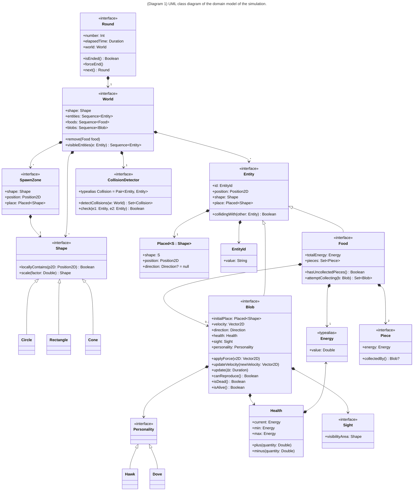
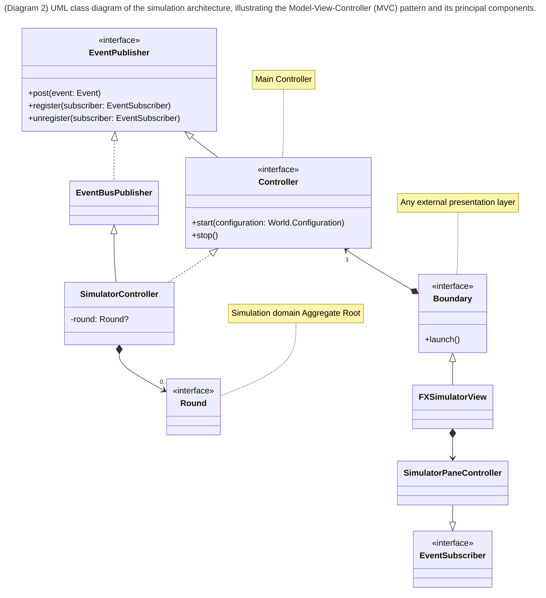
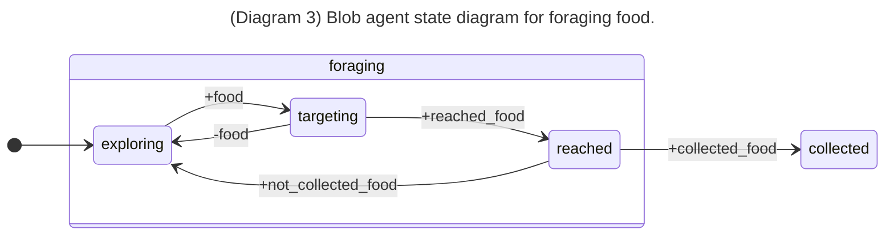
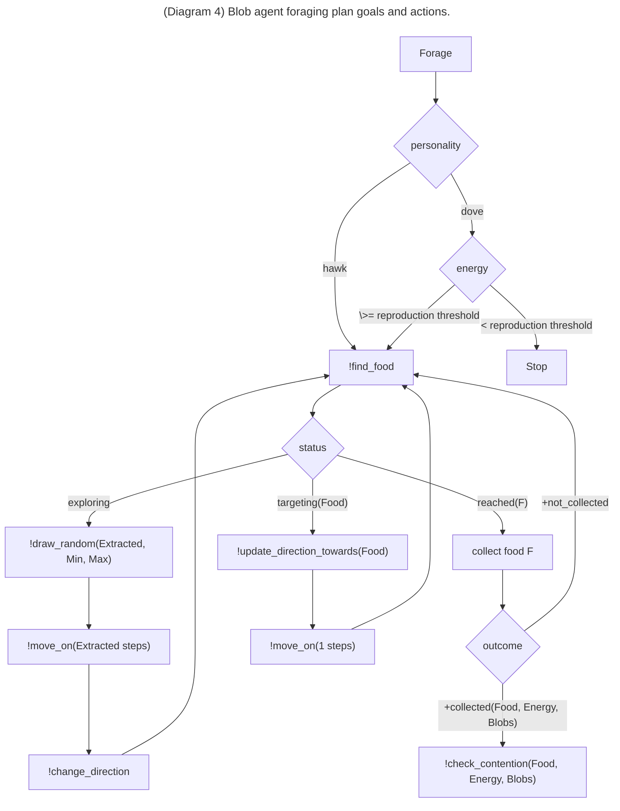

# Evolutionary Agent-based Aggression Simulation - EvASim

1. [Goals of the project](#goals-of-the-project)
2. [Requirements Analysis](#requirements-analysis)
3. [Design](#design)
   1. [Domain model](#domain-model)
   2. [Architecture](#architecture)
   3. [Agents design](#agents-design)
      1. [Food search and collection](#food-search-and-collection)
      2. [Contention](#contention)
4. [Salient implementation details](#salient-implementation-details)
5. [Results](#results)
6. [Deployment instructions](#deployment-instructions)
7. [Conclusions](#conclusions)
   1. [JakTa suggested improvements](#jakta-suggested-improvements)
   2. [Future work](#future-work)

## Goals of the project

> The goal of the project is to simulate an environment using a BDI Agent framework in which agents simulate two types of creatures, doves and hawks, that compete for survival based on their behaviors, observing how the evolution of the species unfolds. [^1]

[^1]: The project has been taken inspiration from the [Simulating the Evolution of Aggression, by Primer](https://www.youtube.com/watch?app=desktop&v=YNMkADpvO4w&t=5s)'s video.

## Requirements Analysis

- The simulation is composed of a sequence of rounds;
- Food is spawned casually inside the map;
- Food pieces come in pairs and each one of them can be further split in half.
- Each food can be eaten only when two blob creatures are in contact with it: this to simulate access to resources requires group effort;
- Survival and reproduction rules:
  - eating one piece of food lets a creature survive to the next day;
  - eating two pieces of food allows a blob to both survive and reproduce;
  - a creature always reproduces itself (if they're able to do it) in another creature of the same kind (i.e., doves reproduce doves, hawks reproduce hawks);
  - each creature continues to search for food until they have reached the capacity to reproduce themselves;
    - doves creatures, if they have reached enough food to reproduce will stop searching and wait for the next round to reproduce;
    - hawks creatures, if they have reached enough food to reproduce will continue searching for food until the end of the round to steal food from other creatures as much as possible;
- Contention rules:
  - If both the creatures are doves, they share the food, each taking a piece of food;
  - If one is a dove and one is a hawk, then the hawk shares half of a food piece with the dove and then it immediately steals the other before the dove can take it;
  - If both are hawks they fight over the food, both gaining a piece of it. But since fighting requires energy, they consume all the benefits from eating the food, acquiring zero food.
  - If two entities are competing over a pair of food and a third tries to join then the latter notices the other two and gives up taking that food.
- Movements:
  - Creatures explore the map using random movements.
  - They have a limited sight of the environment that they're exploring. If they find a piece of food they proceed to move towards it.

## Design

### Domain model



### Architecture

The architecture follows the classic Model-View-Controller (MVC) pattern.
Domain Model updates are reified in events that are published towards subscribed boundaries through an event bus.

An overview of the architecture is shown in the following diagram:



### Agents design

The simulation is composed of a moltitude of `Blob` agents, each one simulating the behavior of a blob creature in the simulation world environment depending on its personality.

In the following sections are described the behaviors of the agents in terms of their beliefs, desires and intentions (BDI) and the actions they can perform on the environment, affecting the world state.

The primary goal of each agent is to obtain enough food each day to survive and reproduce, thereby driving the evolution of its species.

#### Food search and collection

The high level behavior of the agents is described in the following UML state diagram that shows the main states the agents can be in during the simulation.
State transitions events in the diagram reflect updates to the agent's belief base, triggered by environmental changes during the perception phase of the agent's reasoning cycle (`+belief` means `belief` has been added, while `-belief` means `belief` has been removed).

- At the start of the simulation, each agent is spawned at a random position within the world and their goal is to find and collect food. Since they do not know their exact position and have limited sight, they explore the world randomly (`exploring` state).
- When an agent finds food, it moves toward it, entering the `targeting` state.
- Upon reaching the food, the agent tries to collect it (`reached` state). Depending on the number of agents trying to collect the same food, an agent may either:
  - Successfully collect the food (`collected` state), or
  - Fail to collect it and return to the `exploring` state to continue searching.



More specifically:

- depending on the agent's personality, the agent stops searching for food when it has enough energy to reproduce itself: _doves_ stop searching, while _hawks_ continue searching until the end of the round
  - this is to simulate the fact that _hawks_ are more aggressive and will try to steal food from other agents as much as possible, while _doves_ are more peaceful and will not try to steal food from others that are unused;
- the exploration is performed by moving in a random direction for a certain number of steps (drawn randomly from a range of values), followed by a change of direction;
- when an agent "sees" food in its sight that still has uncollected pieces, it starts moving towards it, one step at a time, changing its direction to point towards the food;
  - if multiple foods with uncollected pieces are in the agent's sight, the one that has some uncollected pieces, yet not completely collected is chosen as the target, fallback to the closest one if all are not fully collected;
- when the agent reaches the food, it tries to collect it;
  - depending on the outcome of the collection attempt, the agent may either:
    - proceed to the contention phase (described in the next section);
    - return to exploring searching for food.

In the following diagram is shown more in detail the plan of the agent.
Jason syntax is used to differentiate between goals (`!`), belief updates (`+`/`-`) and actions (no special prefix). 
Decision nodes represented by diamond in the flowchart are used to represent guards in the agent's plan.



#### Contention

## Salient implementation details

## Results

## Deployment instructions

The application is [distributed as a `jar` on GitHub releases](https://github.com/giovaz94/isee-project-2023-2024/releases/latest).
To run the application, you can simply execute the following command:

```bash
java -jar <path-to-jar>/evasim-<version>-all.jar
```

Alternatively you can build the project using Gradle and run it from the command line:

```bash
./gradlew run
```

## Conclusions

### JakTa suggested improvements

- [Bug] sleep and stop bugs
- [Improvement] use thread pool to run the simulation
- [Improvement] let updateData return an outcome that can be used agent-side (in Jason a boolean in the actions)

### Future work

Possible extensions:

- food discovery by "tips" from other agents

  - _doves_ provide correct tips
  - while _hawks_ provide wrong tips
  - only _doves_ listen to the correct tips

- _doves_ network among themselves by "shouting" when they have been hawked
