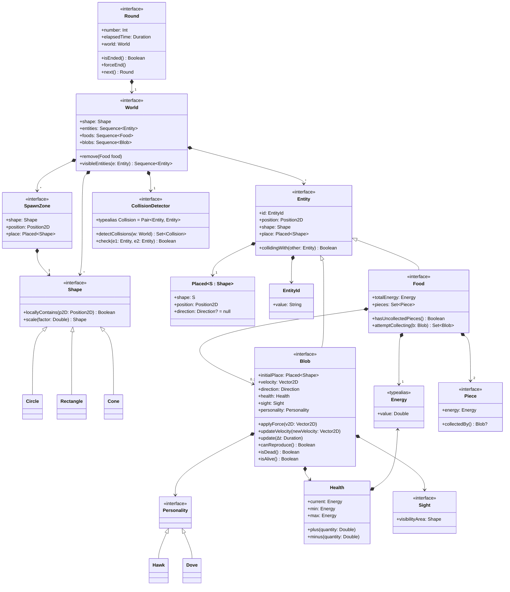
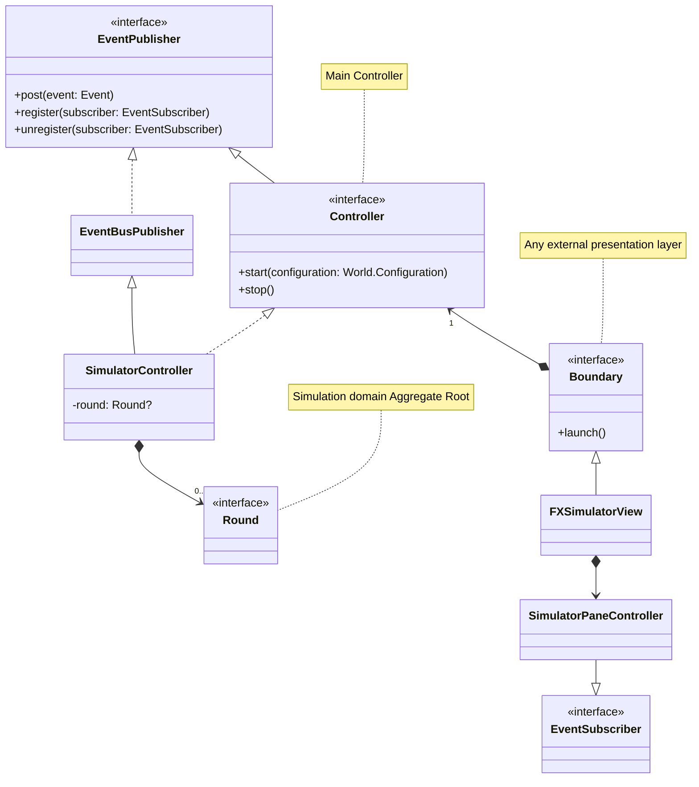
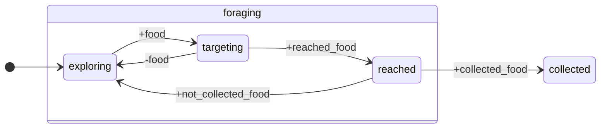
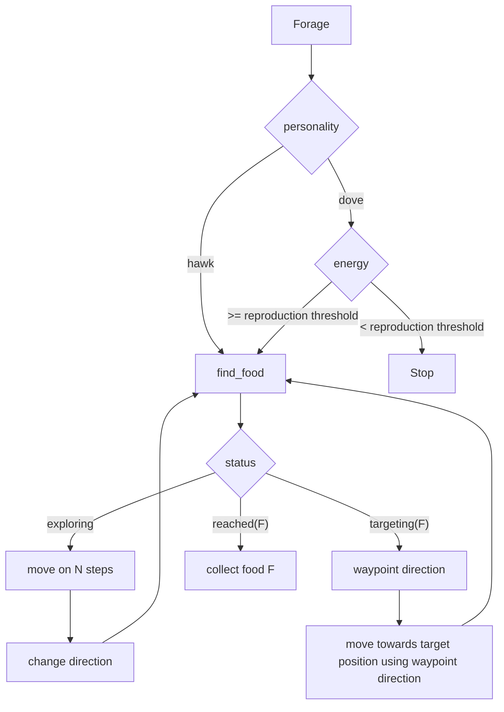

# Evolutionary Agent-based Aggression Simulation - EvASim

1. [Goals of the project](#goals-of-the-project)
2. [Requirements Analysis](#requirements-analysis)
   1. [Functional requirements](#functional-requirements)
   2. [Non-functional requirements](#non-functional-requirements)
3. [Design](#design)
   1. [Domain model](#domain-model)
   2. [Architecture](#architecture)
   3. [Agents design](#agents-design)
      1. [Food search and collection](#food-search-and-collection)
      2. [Contention](#contention)
4. [Salient implementation details](#salient-implementation-details)
5. [Results](#results)
6. [Deployment instructions](#deployment-instructions)
7. [Conclusions](#conclusions)
   1. [JakTa suggested improvements](#jakta-suggested-improvements)
   2. [Future work](#future-work)

## Goals of the project

> The goal of the project is to simulate an environment using a BDI Agent framework in which agents simulate two types of creatures, doves and hawks, that compete for survival based on their behaviors, observing how the evolution of the species unfolds.

## Requirements Analysis

### Functional requirements

- The simulation is composed of a sequence of rounds;
- Food is spawned casually inside the map;
- Food pieces come in pairs and each one of them can be further split in half.
- Each food can be eaten only when two blob creatures are in contact with it: this to simulate access to resources requires group effort;
- Survival and reproduction rules:
  - eating one piece of food lets a creature survive to the next day;
  - eating two pieces of food allows a blob to both survive and reproduce;
  - a creature always reproduces itself (if they're able to do it) in another creature of the same kind (i.e., doves reproduce doves, hawks reproduce hawks);
  - each creature continues to search for food until they have reached the capacity to reproduce themselves;
    - doves creatures, if they have reached enough food to reproduce will stop searching and wait for the next round to reproduce;
    - hawks creatures, if they have reached enough food to reproduce will continue searching for food until the end of the round to steal food from other creatures as much as possible;
- Contention rules:
  - If both the creatures are doves, they share the food, each taking a piece of food;
  - If one is a dove and one is a hawk, then the hawk shares half of a food piece with the dove and then it immediately steals the other before the dove can take it;
  - If both are hawks they fight over the food, both gaining a piece of it. But since fighting requires energy, they consume all the benefits from eating the food, acquiring zero food.
  - If two entities are competing over a pair of food and a third tries to join then the latter notices the other two and gives up taking that food.
- Movements:
  - Creatures explore the map using random movements.
  - They have a limited sight of the environment that they're exploring. If they find a piece of food they proceed to move towards it.

### Non-functional requirements

`TODO`

## Design

### Domain model



### Architecture

The architecture follows the classic Model-View-Controller (MVC) pattern.
Domain Model updates are reified in events that are published towards subscribed boundaries through an event bus.

An overview of the architecture is shown in the following diagram:



### Agents design

The simulation is composed of a moltitude of `Blob` agents, each one simulating the behavior of a blob creature in the simulation world environment depending on its personality.

In the following sections are described the behaviors of the agents in terms of their beliefs, desires and intentions (BDI) and the actions they can perform on the environment, affecting the world state.

The primary goal of each agent is to obtain enough food each day to survive and reproduce, thereby driving the evolution of its species.

#### Food search and collection

As the simulation starts, each agent is spawned in a random position inside the world and its goal is to find food and collect it.
Since the agents are not aware of their position in the world and they have a limited sight, they explore the world randomly until they find a food.
Once found a food, the agent will try to move towards it in order to attempt to collect it.
In case multiple foods are present in the agent's sight, the agent will priviledge the one already collected by other agents to obey the general assumption of need of cooperation to collect food.

...

A punti?





#### Contention

<!--

#### Goals

- `+!find_food`: reazione dell'agente: in futuro può essere programmato un comportamento più intelligente
del semplice continuare a muoversi verso la direzione prestabilita iniziale per cercare di "spottare" il cibo

#### Belief

+ `food` => viene aggiunto alla belief base quando il food è nel sight dell'agente
+ `reached_food` => viene aggiunto quando l'agente ha raggiunto il food

#### Actions

- `move_towards(X, Y)`: agents move towards the given coordinates (X, Y)
- `collect_food(Food_ID)`: agents collect the given food


```jason
direction(0, 0).
speed(0).
status(exploring).

!round.

+!round <-
  !find_food;
  !collect_food;
  !contention;
  !back_home.

+!find_food : status(exploring) <-
  !change_direction;
  random(N, 1, 20); // N is the number of steps to take following the direction
  !move_on(N);
  !find_food.

+!find_food : status(targeting(F)) & position(PosX, PosY) <-
  waypoint_direction(PosX, PosY, F, DirX, DirY);
  -+direction(DirX, DirY);
  !move.
  !find_food.

+!find_food : status(reached(F)) <- true.

+!move_on(0) <- true.

+!move_on(N) : N > 0 & status(exploring) <-
  !move;
  !move_on(N - 1).

+!move_on(N) : N > 0 & (obstacle(X, Y) | not(status(exploring))) <- true.

// TODO: obstacle avoidance. How to deal with multiple obstacles?
+!change_direction : not(obstacle)) <-
  random(X, -1, 1);
  random(Y, -1, 1);
  -+direction(X, Y).

+!change_direction : obstacle() & direction(X, Y) <-
  // TODO...
  -+direction(-X, -Y); // Reverse direction when an obstacle is detected

+!move : direction(X, Y) & speed(V) <-
  !update_position(X, Y, V); // External action

+!collect_food : food(F) <-
  collect_food(F, IsCollected); // External action
  if (IsCollected) {
    -+status(contending(F));
    !contention;
  } else {
    -+status(exploring);
    !find_food;
  }

+target_food(F) <- // Belief added from the environment
  status(targeting(F)).

+reached_food(F) : status(targeting(F)) <- // Belief added from the environment
  status(reached(F)).

```

-->

## Salient implementation details

## Results

## Deployment instructions

The application is [distributed as a `jar` on GitHub releases](https://github.com/giovaz94/isee-project-2023-2024/releases/latest).
To run the application, you can simply execute the following command:

```bash
java -jar <path-to-jar>/evasim-<version>-all.jar
```

Alternatively you can build the project using Gradle and run it from the command line:

```bash
./gradlew run
```

## Conclusions

### JakTa suggested improvements

### Future work

Possible extensions:

- food discovery by "tips" from other agents

  - _doves_ provide correct tips
  - while _hawks_ provide wrong tips
  - only _doves_ listen to the correct tips

- _doves_ network among themselves by "shouting" when they have been hawked
