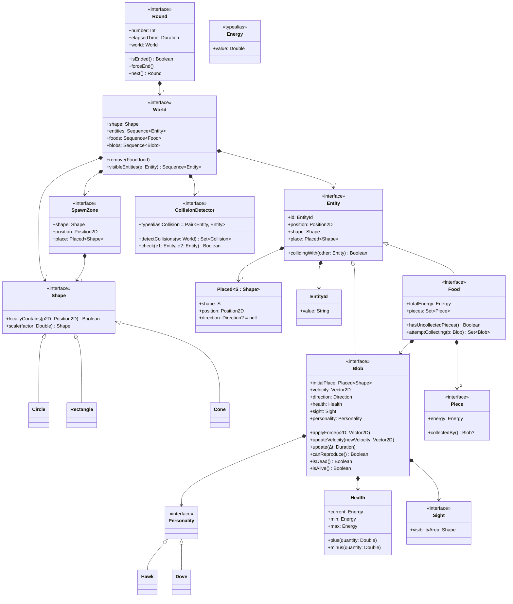

# Evolutionary Agent-based Aggression Simulation - EvASim

## Goals of the project

> The goal of the project is to simulate an environment using a BDI Agent framework in which agents simulate two types of creatures, doves and hawks, that compete for survival based on their behaviors, observing how the evolution of the species unfolds.

## Requirements Analysis

### Functional requirements

- The simulation is composed of a sequence of days / rounds;
- Food is spawned casually inside the map;
- Food pieces come in pairs and each one of them can be further split in half.
- Survival and reproduction rules:
  - eating one piece of food lets a creature survive to the next day and eating two piece of food allows a blob to both survive and reproduce;
  - a creature of one kind always reproduce itself (if they’re able to do it) in another creature of the same kind
  - each creature continues to search for food until they have reached the capacity to reproduce themselves. If the day is over or they have eaten enough food to reproduce they return home.
- Contention rules:
  - if a single entity tries to pick up a pair of food it will succeed if no other entities are also trying to take the same pair.
  - if another entity is trying to take the same pair of food the following scenarios applies, depending on the other creature:
    - If both are doves they share the food, each taking a piece of food;
    - If one is a dove and one is a hawk, then the hawk shares half of a food piece with the dove and then it immediately steals the other before the dove can take it;
    - If both are hawks then they fight over the food both gaining a piece of it. But, since fighting requires energy they consume all the benefits from eating the food, acquiring 0 food.
  - If two entities are competing over a pair of food and a third tries to join then the latter notices the other two and gives up taking that food.
- Movements:
  - Creatures explore the map using random movements.
  - They have a limited sight of the environment that they’re exploring. If they find a piece of food they proceed to move towards it.

### Non-functional requirements

`TODO`

## Design

### Domain model



### Agents design

<!--

#### Goals

- `+!find_food`: reazione dell'agente: in futuro può essere programmato un comportamento più intelligente
del semplice continuare a muoversi verso la direzione prestabilita iniziale per cercare di "spottare" il cibo

#### Belief

+ `food` => viene aggiunto alla belief base quando il food è nel sight dell'agente
+ `reached_food` => viene aggiunto quando l'agente ha raggiunto il food

#### Actions

- `move_towards(X, Y)`: agents move towards the given coordinates (X, Y)
- `collect_food(Food_ID)`: agents collect the given food


```jason
direction(0, 0).
speed(0).
status(exploring).

!round.

+!round <-
  !find_food;
  !collect_food;
  !contention;
  !back_home.

+!find_food : status(exploring) <-
  !change_direction;
  random(N, 1, 20); // N is the number of steps to take following the direction
  !move_on(N);
  !find_food.

+!find_food : status(targeting(F)) & position(PosX, PosY) <-
  waypoint_direction(PosX, PosY, F, DirX, DirY);
  -+direction(DirX, DirY);
  !move.
  !find_food.

+!find_food : status(reached(F)) <- true.

+!move_on(0) <- true.

+!move_on(N) : N > 0 & status(exploring) <-
  !move;
  !move_on(N - 1).

+!move_on(N) : N > 0 & (obstacle(X, Y) | not(status(exploring))) <- true.

// TODO: obstacle avoidance. How to deal with multiple obstacles?
+!change_direction : not(obstacle)) <-
  random(X, -1, 1);
  random(Y, -1, 1);
  -+direction(X, Y).

+!change_direction : obstacle() & direction(X, Y) <-
  // TODO...
  -+direction(-X, -Y); // Reverse direction when an obstacle is detected

+!move : direction(X, Y) & speed(V) <-
  !update_position(X, Y, V); // External action

+!collect_food : food(F) <-
  collect_food(F, IsCollected); // External action
  if (IsCollected) {
    -+status(contending(F));
    !contention;
  } else {
    -+status(exploring);
    !find_food;
  }

+target_food(F) <- // Belief added from the environment
  status(targeting(F)).

+reached_food(F) : status(targeting(F)) <- // Belief added from the environment
  status(reached(F)).

```

-->

## Salient implementation details

## Results

## Deployment instructions

The application is [distributed as a `jar` on GitHub releases](https://github.com/giovaz94/isee-project-2023-2024/releases/latest).
To run the application, you can simply execute the following command:

```bash
java -jar <path-to-jar>/evasim-<version>-all.jar
```

Alternatively you can build the project using Gradle and run it from the command line:

```bash
./gradlew run
```

## Conclusions

### JakTa suggested improvements

### Future work 

Possible extensions:

- food discovery by "tips" from other agents
  - _doves_ provide correct tips
  - while _hawks_ provide wrong tips
  - only _doves_ listen to the correct tips

- _doves_ network among themselves by "shouting" when they have been hawked
