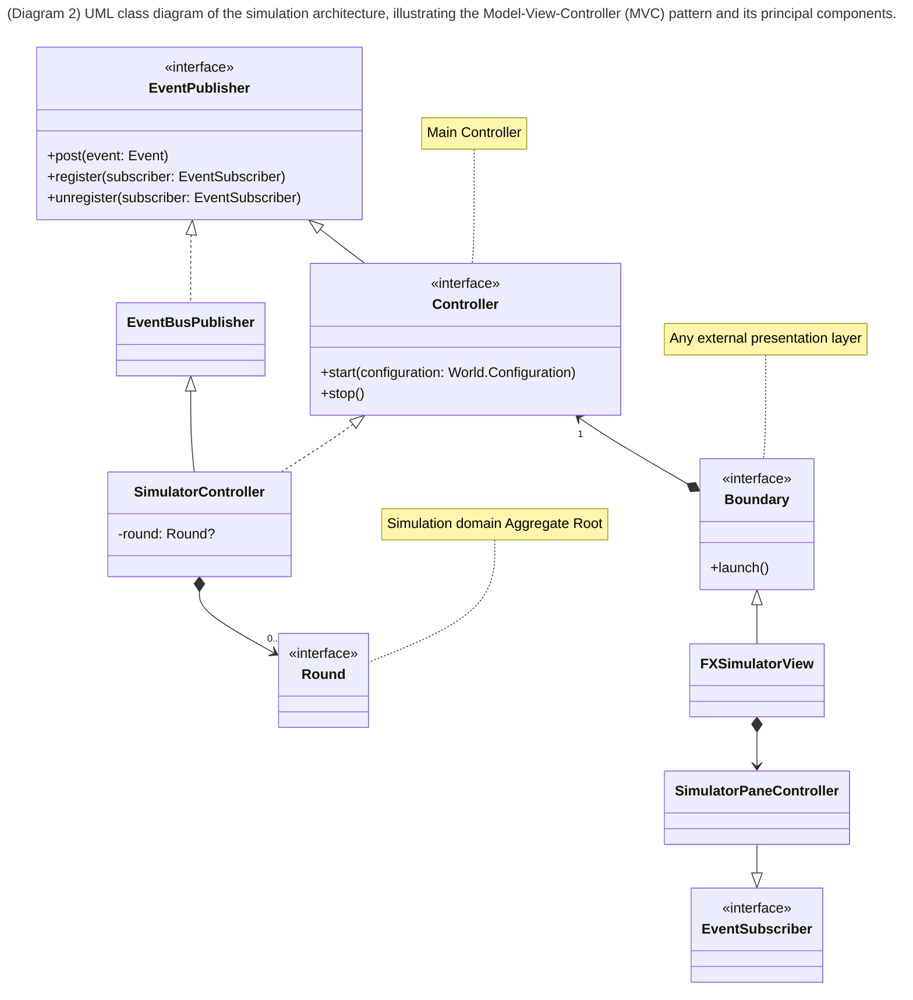
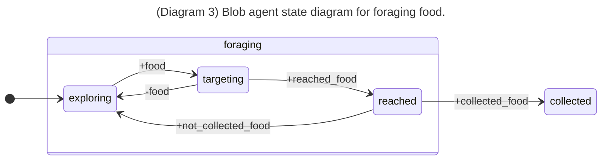
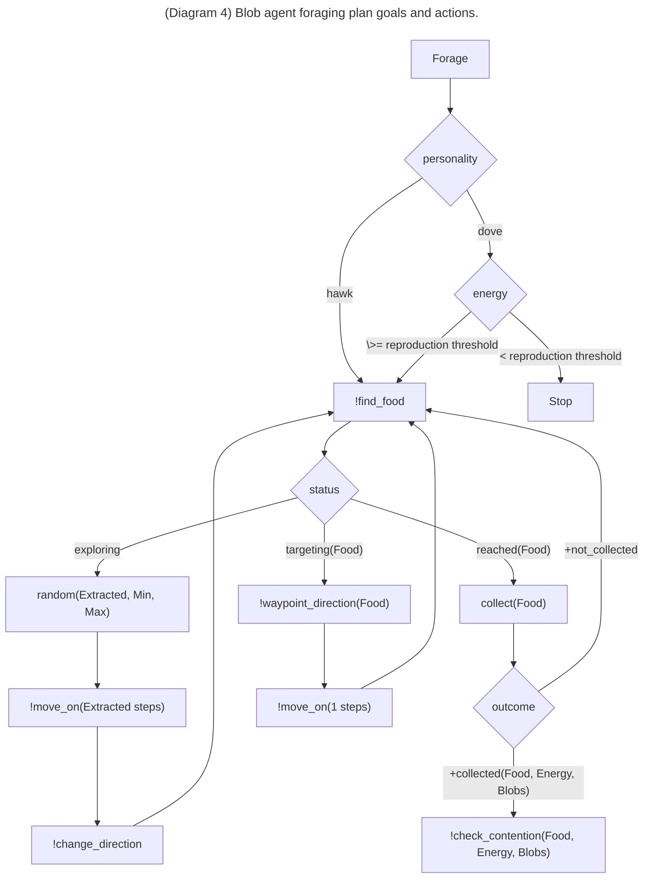
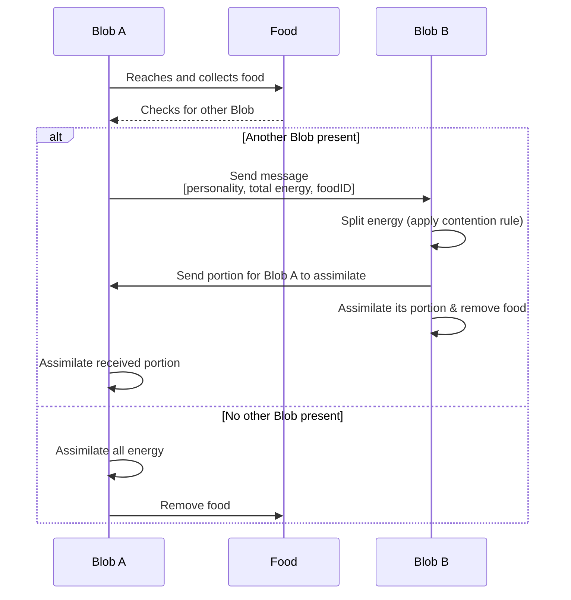
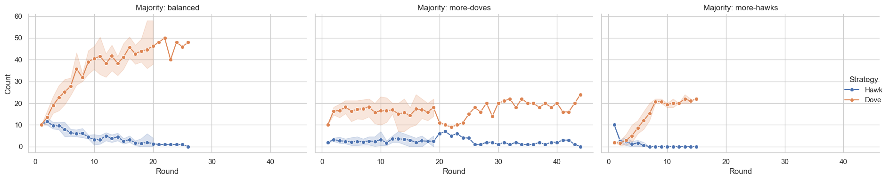

# Evolutionary Agent-based Aggression Simulation - EvASim

1. [Goals of the project](#goals-of-the-project)
2. [Requirements Analysis](#requirements-analysis)
   1. [Non functional requirements](#non-functional-requirements)
   2. [Implementation requirements](#implementation-requirements)
3. [Design](#design)
   1. [Domain model](#domain-model)
   2. [Architecture](#architecture)
   3. [Agents design](#agents-design)
      1. [Food search and collection](#food-search-and-collection)
      2. [Contention](#contention)
4. [Salient implementation details](#salient-implementation-details)
   1. [Food collection](#food-collection)
   2. [Addressing reproducibility](#addressing-reproducibility)
5. [Results](#results)
6. [Deployment instructions](#deployment-instructions)
7. [Conclusions](#conclusions)
   1. [JaKtA suggested improvements](#jakta-suggested-improvements)
   2. [Future work](#future-work)

## Goals of the project

> The goal of the project is to simulate an environment using a BDI Agent framework in which agents simulate two types of creatures, doves and hawks, that compete for survival based on their behaviors, observing how the evolution of the species unfolds. [^1]

[^1]: The project has been taken inspiration from the [Simulating the Evolution of Aggression, by Primer](https://www.youtube.com/watch?app=desktop&v=YNMkADpvO4w&t=5s)'s video.

## Requirements Analysis

- The simulation is composed of a sequence of rounds;
- A fixed amount of food is spawned casually inside the map;
- Food pieces come in pairs and each one of them can be further split in half.
- Each food can be eaten only when two blob creatures are in contact with it: this to simulate access to resources requires group effort;
- Survival and reproduction rules:
  - eating one piece of food lets a creature survive to the next day;
  - eating two pieces of food allows a blob to both survive and reproduce;
  - a creature always reproduces itself (if they're able to do it) in another creature of the same kind (i.e., doves reproduce doves, hawks reproduce hawks);
  - each creature continues to search for food until they have reached the capacity to reproduce themselves;
    - doves creatures, if they have reached enough food to reproduce will stop searching and wait for the next round to reproduce;
    - hawks creatures, if they have reached enough food to reproduce will continue searching for food until the end of the round to steal food from other creatures as much as possible;
- Contention rules:
  - If both the creatures are doves, they share the food, each taking a piece of food;
  - If one is a dove and one is a hawk, then the hawk shares half of a food piece with the dove and then it immediately steals the other before the dove can take it;
  - If both are hawks they fight over the food, both gaining a piece of it. But since fighting requires energy, they consume all the benefits from eating the food, acquiring zero food.
  - If two entities are competing over a pair of food and a third tries to join then the latter notices the other two and gives up taking that food.
- Movements:
  - Creatures explore the map using random movements.
  - They have a limited sight of the environment that they're exploring. If they find a piece of food they proceed to move towards it.

### Non functional requirements

- The simulation should be able to run for a long time, simulating the evolution of the species over many rounds, with a decent number of agents (> 60) without crashing or having performance issues.

### Implementation requirements

- For what concern the Agent BDI framework, [JaKtA](https://JaKtA-bdi.github.io) has been chosen as it is a Kotlin-based DSL that should allow to implement BDI agents in a declarative way and seamlessly integrate with object-oriented and functional programming paradigms, taking full advantage of Kotlin's modern features and syntax.

## Design

This section presents the system design, covering the domain model, architecture, and agent design with particular 
emphasis on the latter.

By working with [JaKtA](https://JaKtA-bdi.github.io), we were able to clearly separate the “passive” and “active” parts 
of the system. The passive part maintains the domain classes that describe the environment, while the active part 
manages the agents and their interactions.


### Domain model


### Architecture

The architecture follows the classic Model-View-Controller (MVC) pattern.
The agent management component communicates with the domain layer to update the simulation state, which in turn affects
the environment rendered in the GUI.This interaction is handled via an EventBus: domain classes act as event emitters,
while the GUI controller subscribes to these events.When an agent updates an entity, it triggers an event, prompting
the GUI controller to render the updated entity accordingly.

An overview of the architecture is shown in the following diagram:



### Agents design

The simulation is composed of a multitude of `Blob` agents, each one simulating the behavior of a blob creature in the simulation world environment depending on its personality.

In the following sections are described the behaviors of the agents in terms of their beliefs, desires and intentions (BDI) and the actions they can perform on the environment, affecting the world state.

The primary goal of each agent is to obtain enough food each day to survive and reproduce, thereby driving the evolution of its species.

#### Food search and collection

The high level behavior of the agents is described in the following UML state diagram that shows the main states that agents can assume during the simulation.
State transitions events in the diagram reflect updates to the agent's belief base, triggered by environmental changes during the perception phase of the agent's reasoning cycle (`+belief` means `belief` has been added, while `-belief` means `belief` has been removed).

- At the start of the simulation, each agent is spawned at a random position within the world and their goal is to find and collect food. Since they do not know their exact position and have limited sight, they explore the world randomly (`exploring` state).
- When an agent finds food, it moves toward it, entering the `targeting` state.
- Upon reaching the food, the agent tries to collect it (`reached` state). Depending on the number of agents trying to collect the same food, an agent may either:
  - Successfully collect the food (`collected` state), or
  - Fail to collect it and return to the `exploring` state to continue searching.



More specifically:

- depending on the agent's personality, the agent stops searching for food when it has enough energy to reproduce itself: _doves_ stop searching, while _hawks_ continue searching until the end of the round
  - this is to simulate the fact that _hawks_ are more aggressive and will try to steal food from other agents as much as possible, while _doves_ are more peaceful and will only try to gain the necessary amount of energy in order to reproduce themselves;
- the exploration is performed by moving in a random direction for a certain number of steps (drawn randomly from a range of values), followed by a change of direction;
- when an agent "sees" food in its sight that still has uncollected pieces, it starts moving towards it, one step at a time, changing its direction to point towards the food (`waypoint_direction` goal);
  - if multiple foods with uncollected pieces are in the agent's sight, the one that has some uncollected pieces, yet not completely collected is chosen as the target, fallback to the closest one if all are not fully collected;
- when the agent reaches the food, it tries to collect it;
  - depending on the outcome of the collection attempt, the agent may either:
    - proceed to the contention phase (described in the next section);
    - return to exploring searching for food.

In the following diagram is shown more in detail the plan of the agent.
Jason syntax is used to differentiate between goals (`!`), belief updates (`+`/`-`) and actions (no special prefix).
Decision nodes represented by diamond in the flowchart are used to represent guards in the agent's plan.



#### Contention

Once two agents reach the same piece of food, they will enter in a `contention` phase. 
Based on their personalities, they will begin to gain energy from the shared food source.  
A general overview of this process is shown in the following diagram:



- When a blob reaches a piece of food in the environment and successfully collects it, it will check whether any other
  Blob has collected the same food.
    - If another blob is present, the first blob will send a message to the other one containing:
        - its personality;
        - the total energy of the food;
        - the foodID.

- The blob that receives this message will then _split_ the food’s energy according to a contention rule.This rule  
  determines how the energy should be divided is based on both blob personalities.
- The blob will then proceed to assimilate its portion accordingly, eliminating the food from the environment
  and sending a message to the other one containing the energy that should assimilate from the contention
- Finally, the blob that ha received the message will proceed to update its energy accordingly.

## Salient implementation details

The following sections highlight specific implementation details that are relevant for the application and agent implementation.

The codebase is organized in the following package structure:

- `model` contains the domain model classes, programmed in "plain" Object-Oriented Kotlin;
- `view` contains the user interface classes, implemented using JavaFX;
- `controller` contains the main controller bridging the model and the view;
- `agents` contains the agent classes, implementing the BDI framework using JaKtA.

```plaintext
.
└── evasim
    ├── EvaSimApp.kt
    ├── agents                          # Agent-oriented components - active entities
    │   ├── BlobAgent.kt                # The Blob agent specification with its BDI plan
    │   ├── ExternalActions.kt          # Where external actions affecting the environment are implemented
    │   ├── InternalActions.kt          # Where internal actions are implemented
    │   ├── Literals.kt                 # Literals used in the agent's plan
    │   └── SimulationEnvironment.kt    # The environment where the agents live and interact
    ├── controller                      # Main simulation controller
    │   ├── Boundary.kt
    │   └── SimulatorController.kt
    ├── model                           # Domain model classes - passive entities
    │   ├── Round.kt
    │   ├── World.kt
    │   ├── Blob.kt
    │   ├── ...
    ├── utils                           # Some utility classes and functionalities
    │   ├── Logic.kt
    │   ├── ...
    └── view                            # The user interface classes
```

### Agent plan specification
Here is reported the MAS of a blob agent that is defined inside our application 

<div align="center" style="font-size: 0.9em; color: gray;">

_(<a id="listing1">Listing 1</a>): ...

</div>

```kotlin
fun MasScope.blobAgent(blob: Blob) = agent(blob.id.value) {
    beliefs {
        fact { personality(if (blob.personality is Hawk) "Hawk" else "Dove") }
        fact { energy(0.0) }
        fact { direction(tupleOf(0.0, 0.0)) }
        fact { speed(term = 20.0) }
        fact { status(exploring) }
    }
    actions {
        action(Random)
        action(WaypointDirection)
        action(InverseDirection)
        action(EndRound)
    }
    goals {
        achieve(change_direction)
        achieve(forage)
    }
    plans {
        forage()
        findFood()
        movement()
        collectFood(blob)
        contention(blob)
        endedRound()
    }
    timeDistribution { Time.real(value = 50) }
}
```
#### Beliefs

Agents start with the following beliefs:

- `personality(P)`: is the personality of the blob that moves inside the Environment this could be "Hawk" or "Dove";
- `energy(E)`: is the total energy gained in this round by the agent;
- `direction(tuple(X,Y))`: is the direction that the agent is traveling in space;
- `speed(term = 20.0)`: The current speed of the blob;
- `status(exploring)`: the current status of the agent, initially in `exploring`.

#### Actions

The actions section represents the internal action that an agent can execute during its life cycle:

- `Random`: generates a random value in the range `[LowerBound, UpperBound)`.
- `WaypointDirection`: internal action that calculates the direction that the blob should take to reach the target position.
- `InverseDirection`: internal action that calculates the inverse direction with a refracted angle between -45 and +45 degrees, randomly chosen. 
- `EndRound`: internal action that stops the agent.

#### Initial goals

The goals section in the MAS of the agents represent the initial objectives that an agent aim to achieve during its lifetime.

#### Plans

The `plan` specification list all the available plans the agent can follow as described in the [Agents design](#agents-design) section.

### Food collection

As already described in the [Agents design](#agents-design) section, the food collection is a crucial part of the simulation, as it drives the agents' survival and reproduction, and is implemented as a two-phase process: when an agent reaches a food piece, it attempts to collect it.
If the food has uncollected pieces, the agent proceeds to the contention phase.
However, if multiple agents simultaneously attempt to collect the same food, the collection fails and the agent returns to the exploration phase.

To program such a behavior, the `CollectFood` external action (as shown in [Listing 2](#listing2)) has been implemented to apply the collection side effect on the simulation world state, calling the `updateData` method on the environment.

<div align="center" style="font-size: 0.9em; color: gray;">

_(<a id="listing2">Listing 2</a>): implementation of the `CollectFood` external action._

</div>

```kotlin
/**
 * `collect_food(+FoodId)` external action where the running agent attempts to collect the food
 * identified by `FoodId`.
 * `FoodId` is an [it.unibo.tuprolog.core.Atom] representing the ID of the food to be collected.
 */
internal object CollectFood : AbstractExternalAction(name = collect, arity = 1) {
    override fun action(request: ExternalRequest) {
        val foodId = request.arguments[0].castToAtom().value
        updateData(collect to Pair(request.sender, foodId))
    }
}
```

However, one important aspect to take into consideration is that the outcome of that action may or not, depending on the environment, fail.
Unfortunately, the JaKtA framework does not provide a way to return an outcome as a result of an external action.
To address this, the environment store in a `Map` (see [Listing 3](#listing3))the outcome of the collection attempts performed by each blob so that in the succeeding reasoning cycle the agent can check the outcome and update its belief base accordingly.

<div align="center" style="font-size: 0.9em; color: gray;">

_(<a id="listing3">Listing 3</a>): Definition of the `SimulationEnvironment` class with the data structure used to store the outcomes of the collection attempts._

</div>

```kotlin
/**
 * The list of blob contending for a piece of food.
 */
typealias Contenders = List<Blob>

/**
 * Simulation agent environment.
 */
class SimulationEnvironment(
    private val round: Round,
    agentIDs: Map<String, AgentID> = emptyMap(),
    externalActions: Map<String, ExternalAction> = mapOf(/*...*/)
    messageBoxes: Map<AgentID, MessageQueue> = emptyMap(),
    perception: Perception = Perception.empty(),
    data: Map<String, Any> = mapOf(collectedFood to mutableMapOf<Blob, Pair<Food?, Contenders>>()),
) : EnvironmentImpl(externalActions, agentIDs, messageBoxes, perception, data)
```

[Listing 4](#listing4) shows the implementation of the `updateData` method that updates the environment state storing the outcome of the food collection attempt inside the `data` map.
Once the outcome is stored, the agent, in the next reasoning cycle, can check the outcome and update its belief base, adding a `not_collected_food` belief if the collection failed, or a `collected_food` with all the relevant information needed to proceed with the contention phase if the contention succeeded.

<div align="center" style="font-size: 0.9em; color: gray;">

_(<a id="listing4">Listing 4</a>): implementation of the `updateData` method that updates the environment state with the outcome of the food collection attempt and the related perception logic._

</div>

```kotlin
override fun updateData(newData: Map<String, Any>): Environment {
    val collectedFoods = collectedFoodData.toMutableMap()
    // ...
    if (collect in newData) {
        val (agentID, foodID) = newData[collect] as Pair<String, String>
        round.world.findBlob(agentID)?.let { blob ->
            collectedFoods[blob] = round.world.findFood(foodID)
                ?.let { food -> food to food.attemptCollecting(blob).toList() }
                ?: (null to emptyList())
        }
    }
    // ...
    return copy(data = data + (collectedFood to collectedFoods))
}

override fun percept(agent: Agent): BeliefBase = round.world.findBlob(agent.name)?.let { blob ->
    BeliefBase.of(
        buildList {
            // other beliefs logic...
            addAll(setOfNotNull(collectedFoodOutcomes(blob)))
        },
    )
} ?: BeliefBase.empty()

private fun collectedFoodOutcomes(blob: Blob): Belief? = collectedFoodData[blob]?.let { (food, contenders) ->
    when {
        food == null || contenders.isEmpty() -> not_collected_food().asBelief()
        else -> Struct.of(
            collected_food,
            Atom.of(food.id.value),
            TpList.from(contenders.map { it.id.value.toTerm() }.asSequence()),
            Real.of(food.totalEnergy),
        ).asBelief()
    }
}
```

### Contention

We have already taken care of the aspect of [Contention](#contention) in the design section, we now proceed to describe more in depth the various phases that compose this aspect.
First of all, when an agent reach and collect a piece of food, it will call an external action named `check_contention` (shown in [Listing 5](#listing5):

<div align="center" style="font-size: 0.9em; color: gray;">

_(<a id="listing5">Listing 5</a>): `CheckContention` external action implementation._

</div>

```kotlin
internal class CheckContention(
    private val maxContenders: Int = 2,
) : AbstractExternalAction(check_contention, arity = 4) {
    override fun action(request: ExternalRequest) {
        val contendersId = request.arguments[0].castToList().toList()
        val personality = request.arguments[1].castToAtom()
        val energy = request.arguments[2].castToReal()
        val foodId = request.arguments[3].castToAtom()
        if (contendersId.size == maxContenders) {
            val sender = request.sender
            val message = Message(sender, Tell, Struct.of(contention, personality, energy, foodId))
            contendersId
                .map { it.toString().removeSurrounding("'") }
                .filter { it != sender }
                .forEach { sendMessage(it, message) }
        }
    }
}
```

`CheckContention` accepts as parameter the list of contenders ids that are on the same food: when the fist blob reach it the list is composed only by its ID, only when a second contender reaches the piece of food it will send the following message to the other 

```kotlin
Struct.of(contention, personality, energy, foodId)
```
and starts the contention protocol that is implemented in the [Listing 6](#listing6):

<div align="center" style="font-size: 0.9em; color: gray;">

_(<a id="listing6">Listing 6</a>): `SolveContention` external action implementation._

</div>

```kotlin
internal object SolveContention : AbstractExternalAction(solve_contention, arity = 6) {
    override fun action(request: ExternalRequest) {
        val foodId = request.arguments[0].castToAtom().value
        val contenderId = request.arguments[1].castToAtom().value
        val solverPersonality = request.arguments[2].castToAtom().value.castToPersonality()
        val contenderPersonality = request.arguments[3].castToAtom().value.castToPersonality()
        val totalEnergy = request.arguments[4].castToReal().value.toDouble()
        val solverEnergy = request.arguments[5].castToVar()
        val ruleOutput = contentionRule(solverPersonality, contenderPersonality, totalEnergy)
        val contenderEnergy = ruleOutput.second
        updateData(
            remove_food to foodId,
            update_energy to mapOf(contenderId to ruleOutput.second, request.sender to ruleOutput.first),
        )
        sendMessage(
            contenderId,
            Message(request.sender, Tell, Struct.of(contention_result, Real.of(contenderEnergy))),
        )
        addResults(Substitution.unifier(solverEnergy to Real.of(ruleOutput.first)))
    }
}
```

This will obtain all the necessary information for determining the right amount of energy to send to the contenders, and also will be in charge of removing the food from the Environment.

### Perception

Initially, perception management did not allow information about the percepting agent to be obtained.Following an update to the JaKtA framework API, the `percept` receives as input information about the agent that is performing it.In this way agents are able to perceive a portion of the environment limited to their positioning within the world.

In [Listing 7](#listin7) it is possible to see an example of perception performed by each agent to get the surrounding foods.

<div align="center" style="font-size: 0.9em; color: gray;">

_(<a id="listing7">Listing 7</a>): environment perception implementation._

</div>

```kotlin
override fun percept(agent: Agent): BeliefBase = round.world.findBlob(agent.name)?.let { blob ->
    BeliefBase.of(
        buildList {
            add(position(blob.position).asBelief())
            addAll(blobBounce(blob))
            addAll(foodsCollidingWith(blob))
            addAll(setOfNotNull(foodsSurrounding(blob), collectedFoodOutcomes(blob), endedRound()))
        },
    )
} ?: BeliefBase.empty()

private fun foodsSurrounding(blob: Blob): Belief? = round.world.foods
    .filter { it in blob.sight && it.hasUncollectedPieces() }
    .sortedWith(compareBy<Food> { if (it.hasCollectedPieces()) 0 else 1 }.thenBy { it.distanceTo(blob) })
    .firstOrNull()

// other perceptions...
```

### Addressing reproducibility

Reproducibility is a crucial aspect of simulations—and of science in general— and is what distinguishes between scientific experiments from anecdotal evidence.
Therefore, in implementing the simulation, care has been taken to try to guarantee reproducibility of the experiments and, thus, of the results.

The main two problems that can affect reproducibility are:

1. the concurrency platform used by the underlying BDI framework used to carry out the agent reasoning cycle.
2. random number generation that guides the simulation, e.g., the random placement of the food in the world, the random movements of the agents, and the random decisions made by the agents;

For the first problem, the JaKtA framework allows to choose between different execution strategies, including using one thread per MAS or one thread per agent.
In our case, since the goal was to been able to simulate the evolution of a discrete number of agents, the choice of using one thread per agent was not suitable, as it would have led to a large number of threads being created, which could lead to performance issues.
Therefore, the choice was made to use a single thread to run per MAS, which allows to take under control the execution of the agents' lifecycle.

For the second problem, a single random number generator provider has been used throughout the simulation, which can be seeded by the user to ensure reproducibility in the random number generation and guarantee that every action that depends on some randomness can be reproduced by using the same seed.

Random number provider and configuration can be found inside the `utils` package, [here](https://github.com/giovaz94/isee-project-2023-2024/blob/main/src/main/kotlin/io/github/evasim/utils/RandomProvider.kt).

## Results

In the [original experiment](https://www.youtube.com/watch?v=YNMkADpvO4w&t=445s), blobs interact with food, and consequently with each other, in a synchronous manner: pairs of blobs are selected and automatically placed on a shared food item, which they compete over to gain energy.

Our simulation differs from the original since blobs have the ability to search for food within the environment and will continue searching until they are able to reproduce.

These changes can significantly affect the simulation.
For example, a blob might fail to find any food or could end up competing with the same blob multiple times in a single round.

We conducted the experiments by running 5 simulations, each consisting of a maximum of 20 rounds, while varying the number and type of blobs involved:

- Equal number of _Hawk_ and _Dove_ blobs 
- Majority of _Hawk_ blobs
- Majority of _Dove_ blobs



## Deployment instructions

The application is [distributed as a `jar` on GitHub releases](https://github.com/giovaz94/isee-project-2023-2024/releases/latest).
Choose the appropriate version for your operating system and download it.
To run the application, you can simply execute the following command (Java 17+ is required):

```bash
java -jar <path-to-jar>/evasim-<version>-<os>.jar
```

Alternatively, you can build the project using Gradle that takes care of all dependencies and configurations, Java included, with:

```bash
./gradlew run
```

## Usage example

The simulation is really simple to be used.
Once opened, you have to setup the following parameters:

- number of dove blob agents;
- number of hawk blob agents;
- number of food pieces to spawn at each round;
- optionally, a maximum round duration, expressed in seconds;
- optionally, a seed for the random number generator to ensure reproducibility of the simulation.

Then, you can start the simulation by clicking on the "Start" button.
The simulation can only be stopped and not resumed.


## Conclusions

This project allowed to us to understand with hand-on-code the agent programming paradigm als  

Moreover, trying to build a simulation, even if simple, exposed us to relevant problems, such as performances issues when dealing with a large number of agents to be simulated and reproducibility of the experiments.

Using JaKtA as a BDI framework allowed to meld together the passive OOP design of the domain model with the active BDI agent-oriented design.


### JaKtA suggested improvements

In this section, we summarize the suggested improvements that have been identified during the project development, which could enhance the usability and functionality of the framework.
_Additional details on each of these suggestions can be provided upon request._

- **[Bug]** `sleep` and `stop` agent actions have buggy behavior. 
  As already reported to the library authors, these actions differ in behavior depending on the execution strategy used. More specifically:
  - the `sleepAgent` action does not work as expected if used in `discreteTimeExecution` execution strategy where agents get blocked forever;
  - the `stopAgent` function when invoked in `oneThreadPerMAS` or `discreteTimeExecution` execution strategies does not stop only the agent that invoked it, but all the agents in the MAS.
  - these bugs have been tracked to make them reproducible in [this gist](https://gist.github.com/giovaz94/6261fece98b70abc565ea418db6374d8).

- **[Improvement]** let the `updateData` return an outcome that can be used agent-side to proceed in their BDI plan

  - as presented in the [Food collection section](#food-collection) there are scenario in which external action may fail in executing side effectful computation on the environment and, therefore, is needed to signal the outcome of the action to the agent that invoked it.
    In Jason, for this purpose, the `executeAction` method of the `Environment` returns a `Boolean`:

    ```java
    @Override
    public boolean executeAction(final String ag, final Structure action) { ... }
    ```

    Currently, in JaKtA, outcomes of potentially failing actions can be stored in the environment's state and make them accessible to the agents in form of perception beliefs, but this is counterintuitive and detracts from code clarity.
    From the perspective of a programmer using JaKtA, a cleaner solution would be for `Environment.updateData` to support returning outcomes directly, enabling agents to handle them within their BDI plans—similar to the mechanism used in Jason.

- **[Improvement]** currently, the JaKtA framework allows choosing between two different concurrency abstractions: either one thread per MAS or one thread per agent. However, in large simulations with many agents, neither the two are optimal.
  Therefore, we believe it would be beneficial to introduce a third execution strategy based on a thread pool—such as Java’s ExecutorService—or by leveraging lightweight concurrency models like Java 21 Virtual Threads or Kotlin Coroutines. This would enable more efficient execution of the agents' reasoning cycles by avoiding the overhead of creating a separate thread for each agent.

### Future work

Possible extensions:

- food discovery by "tips" from other agents

  - _doves_ provide correct tips
  - while _hawks_ provide wrong tips
  - only _doves_ listen to the correct tips

- _doves_ network among themselves by "shouting" when they have been hawked
